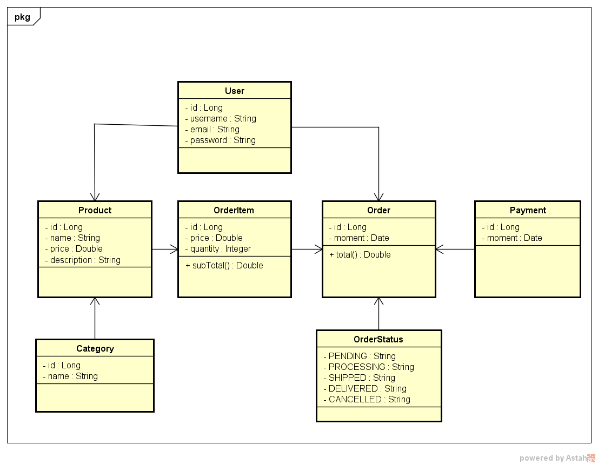

# CAKE CENTER API

Esse é um projeto que visa criar um sistema de compartilhamento e
vendas de produtos alimentícios artesanais, é o que eu chamo
de pseudo-sistema, pois num momento é apenas para fim de testes,
embora a ideia seja deixo totalmente funcional

## Modelo de Domínio



---

## Contrato da API

### Produto

| Operação          | URI            |
|-------------------|----------------|
| Cadastrar Produto | /products      |
| Atualizar Produto | /products/{id} |
| Dados do Produto  | /products/{id} |
| Excluir Produto   | /products/{id} |

- **Cadastrar novo Produto**

``` 
  - Requisição
  URI: /products
  Método: POST
  Body: 
  {
    "name" : "coconut cake",
    "price" : "20.90",
    "description" : "is a cake",
    "categories": [
        { "name" : "cake" }
    ]
  }
  
  - Resposta
  1. Sucesso
  
  Código: 201 - Created
  HEADER: Location - URI do Recurso Criado
  Body: 
  {
    "status": "success",
    "code": 201,
    "data": null
    "message": ""
  }
  
  2.Erro de Validação
  
  Código: 422 - Unprocessable Entity
  Body:
  {
    "status": "error",
    "code": 422,
    "data" : [
        { "field": "name", "error": "nome é obrigatório" }
    ],
    "message": "Erro de Validação"
  }

```

- **Vizualizar Detalhes do Produto**

```
 - Requisição
 URI: /products/{id}
 Método: GET
 
 - Resposta
 1. Sucesso
 
 Código: 200 - Ok
 Body:
{
    "status": "success",
    "code": 200,
    "data":
    {
        "id": 1,
        "name": "coconut cake",
        "price": "20.90",
        "description": "is a cake",
        "categories":
        {
            "id": 1
            "name": "cake"
        }
    }
    "message": "Produto retornado com sucesso!"
}

2. Produto não encontrado

Código: 404 - Not Found
Body:
{
    "status": "success",
    "code": 404,
    "data": null,
    "message": "Nenhum produto encontrado"
}

```

- **Atualização de Produto**
```
 - Requisição
 URI: /products/{id}
 Método: PUT
 Body:
{
    "name": "coconut cake",
    "price": "20.99",
    "description": "is a good cake",
    "categories": [
       {"id": 1, "name": "cake"},
       {"name": "candy"}
    ]
}
 
 - Resposta
 1. Sucesso
 
 Código: 204 - No Content
 Body:
{
    "status": "success",
    "code": 204,
    "data": null
    "message": "Produto atualizado com sucesso!"
}

2.Erro de Validação
  
  Código: 422 - Unprocessable Entity
  Body:
  {
    "status": "error",
    "code": 422,
    "data" : [
        { "field": "name", "error": "nome é obrigatório" }
    ],
    "message": "Erro de Validação"
  }

3. Produto não encontrado

Código: 404 - Not Found
Body:
{
    "status": "success",
    "code": 404,
    "data": null,
    "message": "Nenhum produto encontrado"
}

```

